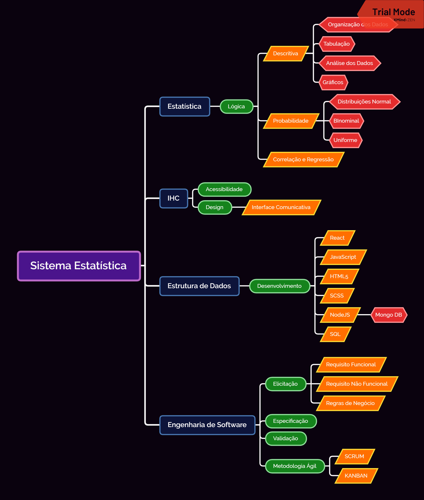

    

        Este projeto foi criado com <a href="https://github.com/facebook/create-react-app">Create React App</a>
    

### Sistema estatística :triangular_ruler: 

Este projeto é resultado de todos conhecimentos adquiridos 
na disciplina de Estatística Aplicada no 3º Período de ADS na [Fatec Franca](https://site.fatecfranca.edu.br/).

### Mapa Mental :game_die:

<i>*Mapa mental desenvolvido com [XMind](https://www.xmind.net/)</i>

### Quero testar! Como?

Para utilizar em ambiente de desenvolvimento é simples!. 

1) <code>git clone https://github.com/GlHenrique/sistema-estatistica.git</code>

2) <code>cd sistema-estatistica</code>

3) <code>yarn install</code>

4) <code>yarn start</code>

## Learn More

You can learn more in the [Create React App documentation](https://facebook.github.io/create-react-app/docs/getting-started).

To learn React, check out the [React documentation](https://reactjs.org/).

### Code Splitting

This section has moved here: https://facebook.github.io/create-react-app/docs/code-splitting

### Analyzing the Bundle Size

This section has moved here: https://facebook.github.io/create-react-app/docs/analyzing-the-bundle-size

### Making a Progressive Web App

This section has moved here: https://facebook.github.io/create-react-app/docs/making-a-progressive-web-app

### Advanced Configuration

This section has moved here: https://facebook.github.io/create-react-app/docs/advanced-configuration

### Deployment

This section has moved here: https://facebook.github.io/create-react-app/docs/deployment

### `yarn build` fails to minify

This section has moved here: https://facebook.github.io/create-react-app/docs/troubleshooting#npm-run-build-fails-to-minify
